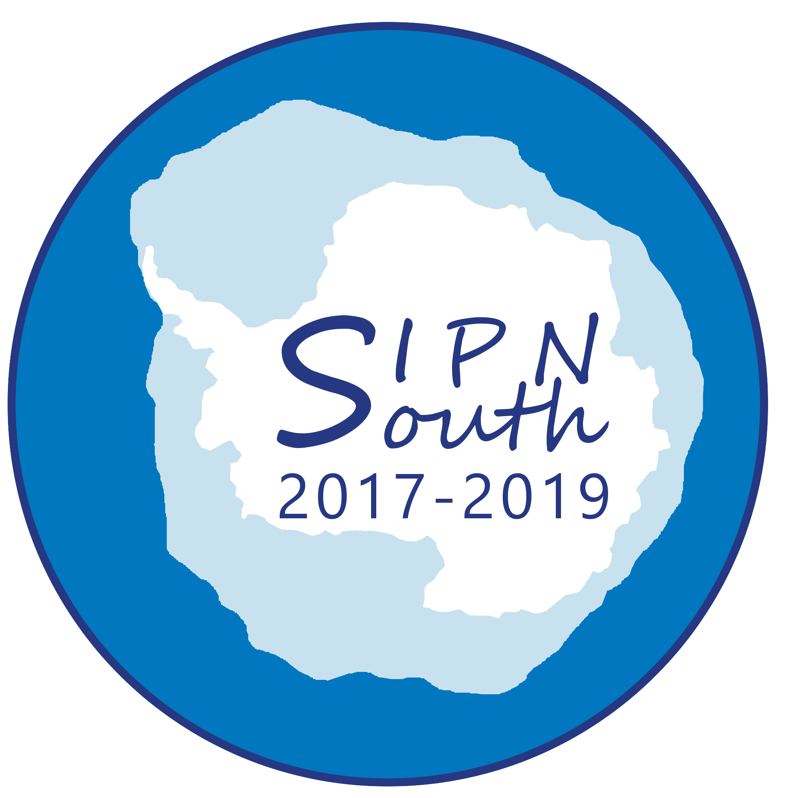

# sipn-south-public
Data and scripts to process Sea Ice Prediction Network South (SIPN South) analyses.



# Quick start
Assuming that Git is installed:
1. In a terminal, do
```
git clone https://github.com/fmassonn/sipn-south-public.git
```
2. Go to the scripts directory to download the SIPN South forecast data:
```
cd sipn-south-public/scripts
./retrieve_data.bash   # Will fill the folder netcdf with data, takes a few minutes
```

3. Process the Python and NCL scripts

* Fig. 1 of the report --> `timeseries_Feb_Antarctic.py`
* Fig. 2 of the report --> Not yet available
* Figs 3. and 4. of the report --> `total-area_analysis.py`
* Fig. 5. of the report --> `SIPN_month_stat_bylon.ncl`
* Fig. 6. of the report --> `SIPN_SIA_daylon_contour.ncl`
* Fig. 7 and 8. of the report --> `spatial_sip.py` and then `assemble.bash`


# Structure of the project
```
data
  txt
    # contains data of total and regional sea ice areas
  netcdf
    # empty at initialization, but can be populated by running the script 
    # ../scripts/retrieve_data.bash . The data will be downloaded from
    # the following link: https://nextcloud.cism.ucl.ac.be/s/gTL53xhjp4iQMM8 

scripts
  # contains scripts to retrieve observational data, forecast data, format them in 
  # CMIP-like format. Also contains scripts to produce figures.

figs
  # empty folder aimed at receiving the figures produced by the scripts

doc
  # contains the form with answer of participating groups to the SIPN South forecast
```
# Reference
F. Massonnet, P. Reid, J. L. Lieser, C. M. Bitz, J. Fyfe, W. Hobbs (2018). Assessment of February 2018 sea-ice forecasts for the Southern Ocean. Technical
Note, Université catholique de Louvain (2018), available at http://acecrc.org.au/sipnsouth/

# Primary Contact
francois.massonnet@uclouvain.be
